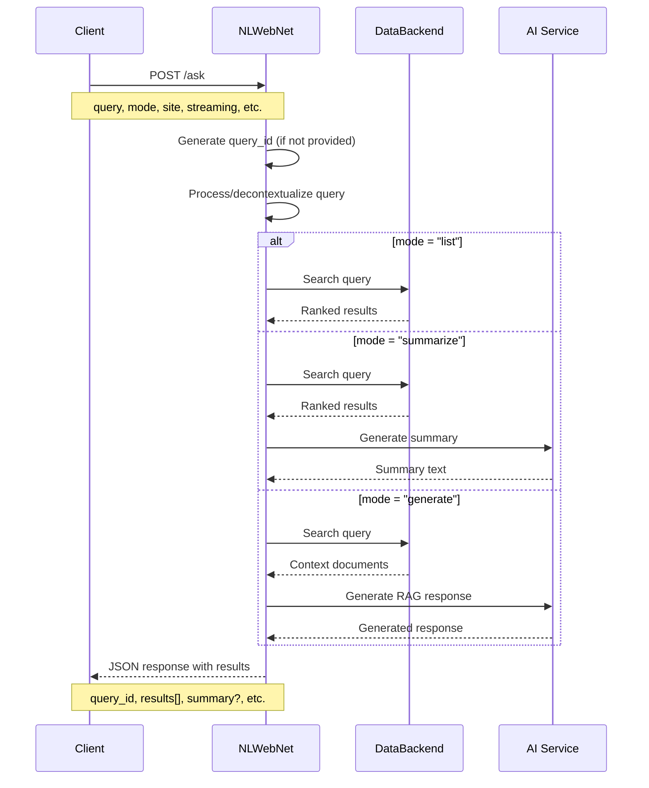
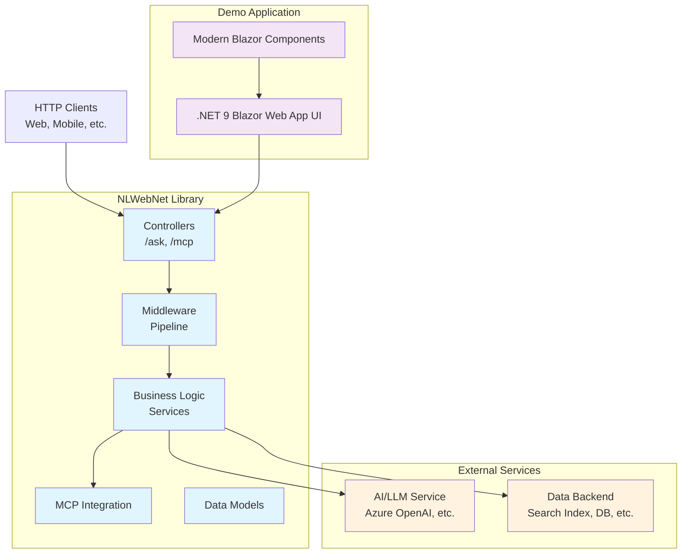

# NLWebNet

A .NET implementation of the [NLWeb protocol](https://github.com/microsoft/NLWeb) for building natural language web interfaces. This project provides both a reusable library and a demo application showcasing the NLWeb standard.

## 📋 Overview

NLWeb is a protocol for creating conversational interfaces to web content and data. It enables natural language querying with three main modes:

- **List**: Returns ranked search results
- **Summarize**: Provides AI-generated summaries with supporting results  
- **Generate**: Full RAG (Retrieval-Augmented Generation) responses

This implementation follows the [official NLWeb specification](https://github.com/microsoft/NLWeb) and includes Model Context Protocol (MCP) support for enhanced AI integration.

## 🏗️ Repository Structure

```
NLWebNet/
├── src/NLWebNet/              # 📦 Core library (future NuGet package)
│   ├── Models/                # Request/response data models
│   ├── Services/              # Business logic interfaces and implementations
│   ├── Controllers/           # API endpoints (/ask, /mcp)
│   ├── MCP/                   # Model Context Protocol integration
│   ├── Middleware/            # ASP.NET Core middleware
│   └── Extensions/            # Dependency injection extensions
├── demo/                      # 🎮 .NET 9 Blazor Web App demo application  
│   ├── Components/            # Modern Blazor components
│   │   ├── Layout/            # Layout components (MainLayout, etc.)
│   │   └── Pages/             # Page components (Home, NLWebDemo, Error)
│   ├── wwwroot/               # Static assets (app.css, favicon, etc.)
│   └── Properties/            # Launch settings and configuration
├── doc/                       # 📚 Documentation
└── tests/                     # 🧪 Unit and integration tests (planned)
```

## 🔄 NLWeb Protocol Flow



## 🎯 API Endpoints

### `/ask` - Primary NLWeb Endpoint

Natural language query interface supporting all NLWeb protocol features.

**Required Parameters:**

- `query` - Natural language query string

**Optional Parameters:**

- `site` - Target site/domain subset
- `prev` - Comma-separated previous queries for context
- `decontextualized_query` - Pre-processed query (skips decontextualization)
- `streaming` - Enable streaming responses (default: true)
- `query_id` - Custom query identifier (auto-generated if not provided)
- `mode` - Query mode: `list` (default), `summarize`, or `generate`

### `/mcp` - Model Context Protocol Endpoint

MCP-compatible interface with additional methods:

- `list_tools` - Available tools
- `list_prompts` - Available prompts
- `call_tool` - Execute tools
- `get_prompt` - Retrieve prompt templates

## 🏛️ Architecture Overview



## 🚀 Quick Start

### Prerequisites

- .NET 9.0 SDK
- Visual Studio 2022 or VS Code

### Running the Demo

1. **Clone the repository**

   ```bash
   git clone https://github.com/jongalloway/NLWebNet.git
   cd NLWebNet
   ```

2. **Build the solution**

   ```bash
   dotnet build
   ```

3. **Run the demo application**

   ```bash
   cd demo
   dotnet run
   ```

4. **Open your browser**
   - Demo UI: `http://localhost:5037`
   - OpenAPI Spec: `http://localhost:5037/openapi/v1.json`

5. **Test the demo features**
   - **Home Page**: Overview and navigation to demo features
   - **Interactive Demo** (`/nlweb`): UI for testing NLWeb queries
     - Query input with natural language questions
     - Mode selection (List, Summarize, Generate)
     - Streaming toggle option
     - *Note: Core NLWeb functionality is under development - currently shows placeholder responses*
   - **API Documentation**: OpenAPI specification for `/ask` and `/mcp` endpoints
     - *Note: API endpoints are planned but not yet implemented*

### Using the Library

Install the NuGet package (when published):

```bash
dotnet add package NLWebNet
```

Configure in your ASP.NET Core application:

```csharp
// Program.cs
builder.Services.AddNLWebNet(options =>
{
    options.DefaultMode = QueryMode.List;
    options.EnableStreaming = true;
});

app.MapNLWebNet();
```

### Testing NLWeb Features (Coming Soon)

Once the core library is implemented, you'll be able to test:

**Interactive Demo (`/nlweb`):**

- Natural language queries like "What are the latest updates?" or "Find documentation about API endpoints"
- **List Mode**: See ranked search results
- **Summarize Mode**: Get AI-generated summaries with supporting results
- **Generate Mode**: Full RAG responses with context-aware answers
- Real-time streaming responses for immediate feedback

**API Testing:**

- Direct HTTP calls to `/ask` endpoint with various parameters
- MCP protocol testing via `/mcp` endpoint
- OpenAPI specification for automated testing and integration

**Example API Usage:**

```bash
# List mode query
curl -X POST "http://localhost:5037/ask" \
  -H "Content-Type: application/json" \
  -d '{"query": "find recent updates", "mode": "list"}'

# Streaming summarize query  
curl -X POST "http://localhost:5037/ask" \
  -H "Content-Type: application/json" \
  -d '{"query": "what are the main features?", "mode": "summarize", "streaming": true}'
```

## ⚙️ Configuration

NLWebNet uses standard ASP.NET Core configuration patterns for managing settings and external service credentials.

### Non-Secret Configuration (appsettings.json)

Configure basic NLWebNet settings in your `appsettings.json`:

```json
{
  "NLWebNet": {
    "DefaultMode": "List",
    "EnableStreaming": true,
    "DefaultTimeoutSeconds": 30,
    "MaxResultsPerQuery": 50
  },
  "Logging": {
    "LogLevel": {
      "Default": "Information",
      "NLWebNet": "Debug"
    }
  }
}
```

### Secret Configuration (User Secrets)

For sensitive data like API keys, use [ASP.NET Core User Secrets](https://learn.microsoft.com/en-us/aspnet/core/security/app-secrets) in development:

1. **Initialize user secrets** for your project:

   ```bash
   dotnet user-secrets init
   ```

2. **Set AI service credentials** (example for Azure OpenAI):

   ```bash
   dotnet user-secrets set "AzureOpenAI:ApiKey" "your-api-key-here"
   dotnet user-secrets set "AzureOpenAI:Endpoint" "https://your-resource.openai.azure.com/"
   dotnet user-secrets set "AzureOpenAI:DeploymentName" "gpt-4"
   ```

3. **Set data backend credentials** (example for Azure Search):

   ```bash
   dotnet user-secrets set "AzureSearch:ApiKey" "your-search-api-key"
   dotnet user-secrets set "AzureSearch:ServiceName" "your-search-service"
   dotnet user-secrets set "AzureSearch:IndexName" "your-index-name"
   ```

### Production Configuration

For production deployments, use:

- **Azure Key Vault** - For secrets in Azure environments
- **Environment Variables** - For containerized deployments
- **Configuration Providers** - Custom providers for other cloud platforms

Example environment variables for production:

```bash
NLWebNet__DefaultMode=List
NLWebNet__EnableStreaming=true
AzureOpenAI__ApiKey=your-production-api-key
AzureSearch__ApiKey=your-production-search-key
```

### Configuration in Code

Access configuration in your application:

```csharp
// Program.cs
builder.Services.AddNLWebNet(options =>
{
    // Bind from configuration
    builder.Configuration.GetSection("NLWebNet").Bind(options);
});

// Configure AI services
builder.Services.Configure<AzureOpenAIOptions>(
    builder.Configuration.GetSection("AzureOpenAI"));

// Configure data backend
builder.Services.Configure<AzureSearchOptions>(
    builder.Configuration.GetSection("AzureSearch"));
```

## 🛠️ Development Status

This is a **proof-of-concept implementation** currently in active development.

**✅ Completed:**

- [x] Project structure and build system
- [x] .NET 9 with OpenAPI documentation
- [x] Official MCP SDK integration
- [x] Modern .NET 9 Blazor Web App demo application
- [x] Blazor app modernized from legacy structure to .NET 9 best practices
- [x] Basic library scaffolding

**🚧 In Progress:**

- [ ] Core data models and validation
- [ ] Business logic services
- [ ] API controllers implementation
- [ ] MCP protocol handlers
- [ ] AI service integration

**📋 Planned:**

- [ ] Multiple data backend support
- [ ] Streaming response implementation
- [ ] Comprehensive testing suite
- [ ] NuGet package publication
- [ ] Production deployment guides

## 🤝 Contributing

This project follows the [NLWeb specification](https://github.com/microsoft/NLWeb). Contributions are welcome!

1. Review the [implementation plan](doc/todo.md)
2. Check [open issues](https://github.com/jongalloway/NLWebNet/issues)
3. Submit pull requests with tests

## 📖 Related Resources

- **[NLWeb Official Repository](https://github.com/microsoft/NLWeb)** - Specification and reference implementation
- **[Model Context Protocol](https://modelcontextprotocol.io/)** - MCP documentation
- **[Microsoft.Extensions.AI](https://learn.microsoft.com/en-us/dotnet/ai/)** - .NET AI abstractions

## 📄 License

This project is licensed under the [MIT License](LICENSE).

## 🏷️ Version

Current version: `1.0.0-alpha` (Pre-release)
