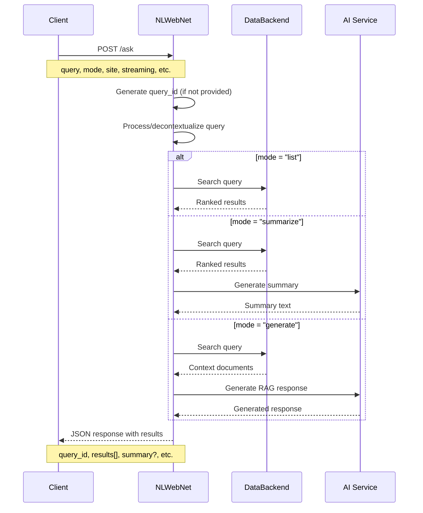
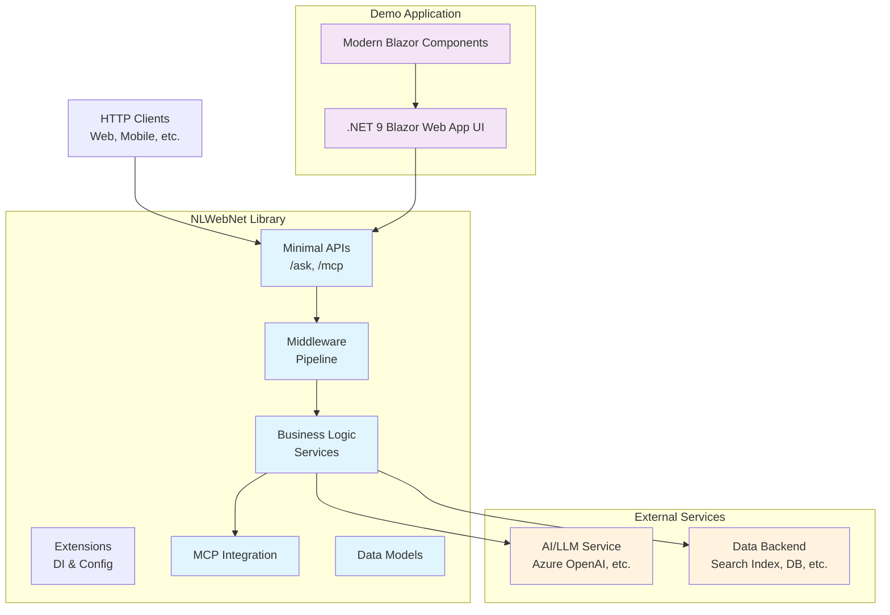

# NLWebNet

[](https://github.com/jongalloway/NLWebNet/actions/workflows/build.yml)
[](https://www.nuget.org/packages/NLWebNet/)
[](https://www.nuget.org/packages/NLWebNet/)
[](https://opensource.org/licenses/MIT)
[](https://dotnet.microsoft.com/download/dotnet/9.0)
[](https://github.com/microsoft/testfx)

A .NET implementation of the [NLWeb protocol](https://github.com/microsoft/NLWeb) for building natural language web interfaces. This project provides both a reusable library and a demo application showcasing the NLWeb standard.

> **⚠️ PROOF OF CONCEPT - NOT PRODUCTION READY**
> 
> This is an experimental implementation created for **testing and evaluation purposes only**. While functional, this library is not intended for production use and should be considered a proof of concept to demonstrate NLWeb protocol capabilities in .NET environments.
>
> **Use cases:**
> - 🧪 Protocol evaluation and experimentation
> - 📚 Learning and understanding NLWeb concepts  
> - 🔬 Research and development prototyping
> - 🎯 Testing integration patterns with AI services
>
> **Not recommended for:**
> - ❌ Production applications
> - ❌ Critical business systems
> - ❌ Public-facing services
> - ❌ Applications requiring enterprise support

## 📋 Overview

NLWeb is a protocol for creating conversational interfaces to web content and data. It enables natural language querying with three main modes:

- **List**: Returns ranked search results
- **Summarize**: Provides AI-generated summaries with supporting results  
- **Generate**: Full RAG (Retrieval-Augmented Generation) responses

This implementation follows the [official NLWeb specification](https://github.com/microsoft/NLWeb) and includes Model Context Protocol (MCP) support for enhanced AI integration.

## 🏗️ Repository Structure

```
NLWebNet/
├── src/NLWebNet/              # 📦 Core library (future NuGet package)
│   ├── Models/                # Request/response data models
│   ├── Services/              # Business logic interfaces and implementations
│   ├── Endpoints/             # Minimal API endpoints (/ask, /mcp)
│   ├── MCP/                   # Model Context Protocol integration
│   ├── Extensions/            # DI and middleware extensions
│   ├── Middleware/            # Request processing middleware
│   ├── Middleware/            # ASP.NET Core middleware
│   └── Extensions/            # Dependency injection extensions
├── demo/                      # 🎮 .NET 9 Blazor Web App demo application  
│   ├── Components/            # Modern Blazor components
│   │   ├── Layout/            # Layout components (MainLayout, etc.)
│   │   └── Pages/             # Page components (Home, NLWebDemo, Error)
│   ├── wwwroot/               # Static assets (app.css, favicon, etc.)
│   └── Properties/            # Launch settings and configuration
├── doc/                       # 📚 Documentation
└── tests/                     # 🧪 Unit and integration tests (planned)
```

## 🔄 NLWeb Protocol Flow



## 🎯 API Endpoints

### `/ask` - Primary NLWeb Endpoint

Natural language query interface supporting all NLWeb protocol features.

**Required Parameters:**

- `query` - Natural language query string

**Optional Parameters:**

- `site` - Target site/domain subset
- `prev` - Comma-separated previous queries for context
- `decontextualized_query` - Pre-processed query (skips decontextualization)
- `streaming` - Enable streaming responses (default: true)
- `query_id` - Custom query identifier (auto-generated if not provided)
- `mode` - Query mode: `list` (default), `summarize`, or `generate`

### `/mcp` - Model Context Protocol Endpoint

MCP-compatible interface with additional methods:

- `list_tools` - Available tools
- `list_prompts` - Available prompts
- `call_tool` - Execute tools
- `get_prompt` - Retrieve prompt templates

## 🏛️ Architecture Overview



## 🚀 Quick Start

> **📋 Note**: This library is provided for **testing and evaluation purposes only**. Please review the development status above before integrating into any project.

### Using the Library in Your Project

1. Add the NLWebNet library to your ASP.NET Core project:

```csharp
// Program.cs
using NLWebNet;

// Add NLWebNet services
builder.Services.AddNLWebNet(options =>
{
    // Configure options
    options.DefaultMode = NLWebNet.Models.QueryMode.List;
    options.EnableStreaming = true;
});

// Later in the pipeline configuration
app.UseNLWebNet();     // Add NLWebNet middleware (optional)
app.MapNLWebNet();     // Map NLWebNet minimal API endpoints
```

### Prerequisites

- .NET 9.0 SDK
- Visual Studio 2022 or VS Code

### Running the Demo

1. **Clone the repository**

   ```bash
   git clone https://github.com/jongalloway/NLWebNet.git
   cd NLWebNet
   ```

2. **Build the solution**

   ```bash
   dotnet build
   ```

3. **Run the demo application**

   ```bash
   cd demo
   dotnet run
   ```

4. **Open your browser**
   - Demo UI: `http://localhost:5037`
   - OpenAPI Spec: `http://localhost:5037/openapi/v1.json`

5. **Test the demo features**
   - **Home Page**: Overview and navigation to demo features
   - **Interactive Demo** (`/nlweb`): UI for testing NLWeb queries
     - Query input with natural language questions
     - Mode selection (List, Summarize, Generate)
     - Streaming toggle option
     - *Note: Core NLWeb functionality is under development - currently shows placeholder responses*
   - **API Documentation**: OpenAPI specification for `/ask` and `/mcp` endpoints
     - *Note: API endpoints are planned but not yet implemented*

### Using the Library

> **⚠️ For testing and evaluation only - not recommended for production use**

Install the NuGet package:

```bash
dotnet add package NLWebNet
```

Or via Package Manager Console:

```powershell
Install-Package NLWebNet
```

Configure in your ASP.NET Core application:

```csharp
// Program.cs
using NLWebNet;

builder.Services.AddNLWebNet(options =>
{
    options.DefaultMode = QueryMode.List;
    options.EnableStreaming = true;
});

app.MapNLWebNet();
```

### Testing NLWeb Features

The demo application at `http://localhost:5037` provides comprehensive testing of all NLWeb protocol features:

**Interactive Demo Pages:**

- **Home Page (`/`)**: Project overview and navigation to demo features
- **NLWeb Demo (`/nlweb`)**: Advanced query interface with tabbed sections:
  - **Query Tab**: Interactive form with all NLWeb parameters (query, mode, site, etc.)
  - **Streaming Tab**: Real-time streaming response demonstration
  - **API Test Tab**: Raw HTTP request/response testing
- **API Test (`/api-test`)**: Comprehensive API testing interface with request configuration
- **MCP Demo (`/mcp-demo`)**: Model Context Protocol demonstration with tools and prompts

**Query Modes Supported:**

- **List Mode**: Returns ranked search results with relevance scoring
- **Summarize Mode**: AI-generated summaries with supporting results  
- **Generate Mode**: Full RAG responses with context-aware answers
- **Streaming**: Real-time response delivery with Server-Sent Events

**API Testing:**

- Direct HTTP calls to `/ask` endpoint with various parameters
- MCP protocol testing via `/mcp` endpoint with tool and prompt support
- OpenAPI specification available at `/openapi/v1.json`
- Comprehensive manual testing guides in `/doc/manual-testing-guide.md`

**Example API Usage:**

```bash
# List mode query
curl -X GET "http://localhost:5037/ask?query=find+recent+updates&mode=list"

# POST request with full parameters
curl -X POST "http://localhost:5037/ask" \
  -H "Content-Type: application/json" \
  -d '{"query": "find recent updates", "mode": "list", "site": "docs", "streaming": false}'

# Streaming summarize query  
curl -X POST "http://localhost:5037/ask" \
  -H "Content-Type: application/json" \
  -d '{"query": "what are the main features?", "mode": "summarize", "streaming": true}'

# MCP tool listing
curl -X POST "http://localhost:5037/mcp" \
  -H "Content-Type: application/json" \
  -d '{"method": "list_tools"}'
```

## 🚀 Deployment

NLWebNet supports multiple deployment strategies for various environments:

### Quick Start - Docker

```bash
# Build and test the Docker image
docker build -t nlwebnet-demo .
docker run -p 8080:8080 nlwebnet-demo

# Or use Docker Compose for development
docker-compose up --build
```

### Production Deployment Options

- **🐳 Docker & Docker Compose** - Containerized deployment with development and production configurations
- **☸️ Kubernetes** - Scalable container orchestration with auto-scaling and health checks
- **🌐 Azure Container Apps** - Serverless container platform with automatic scaling
- **🌍 Azure App Service** - Platform-as-a-Service deployment with integrated monitoring
- **📦 Helm Charts** - Package manager for Kubernetes with templated deployments

### Deployment Guides

- **[Complete Deployment Guide](doc/deployment-guide.md)** - Comprehensive instructions for all platforms
- **[Deployment Scripts](deployment/scripts/)** - Automated deployment scripts
- **[Kubernetes Manifests](deployment/kubernetes/)** - Ready-to-use K8s configurations
- **[Azure Templates](deployment/azure/)** - ARM templates for Azure deployment
- **[Helm Chart](deployment/helm/nlwebnet-demo/)** - Production-ready Helm chart

### Health Monitoring

All deployments include:
- Health check endpoint at `/health`
- Liveness and readiness probes
- Application performance monitoring
- Structured logging and observability

## ⚙️ Configuration

NLWebNet uses standard ASP.NET Core configuration patterns for managing settings and external service credentials.

### Non-Secret Configuration (appsettings.json)

Configure basic NLWebNet settings in your `appsettings.json`:

```json
{
  "NLWebNet": {
    "DefaultMode": "List",
    "EnableStreaming": true,
    "DefaultTimeoutSeconds": 30,
    "MaxResultsPerQuery": 50
  },
  "Logging": {
    "LogLevel": {
      "Default": "Information",
      "NLWebNet": "Debug"
    }
  }
}
```

### Secret Configuration (User Secrets)

For sensitive data like API keys, use [ASP.NET Core User Secrets](https://learn.microsoft.com/en-us/aspnet/core/security/app-secrets) in development:

1. **Initialize user secrets** for your project:

   ```bash
   dotnet user-secrets init
   ```

2. **Set AI service credentials** (example for Azure OpenAI):

   ```bash
   dotnet user-secrets set "AzureOpenAI:ApiKey" "your-api-key-here"
   dotnet user-secrets set "AzureOpenAI:Endpoint" "https://your-resource.openai.azure.com/"
   dotnet user-secrets set "AzureOpenAI:DeploymentName" "gpt-4"
   ```

3. **Set data backend credentials** (example for Azure Search):

   ```bash
   dotnet user-secrets set "AzureSearch:ApiKey" "your-search-api-key"
   dotnet user-secrets set "AzureSearch:ServiceName" "your-search-service"
   dotnet user-secrets set "AzureSearch:IndexName" "your-index-name"
   ```

### Production Configuration

For production deployments, use:

- **Azure Key Vault** - For secrets in Azure environments
- **Environment Variables** - For containerized deployments
- **Configuration Providers** - Custom providers for other cloud platforms

Example environment variables for production:

```bash
NLWebNet__DefaultMode=List
NLWebNet__EnableStreaming=true
AzureOpenAI__ApiKey=your-production-api-key
AzureSearch__ApiKey=your-production-search-key
```

### Configuration in Code

Access configuration in your application:

```csharp
// Program.cs
using NLWebNet;

builder.Services.AddNLWebNet(options =>
{
    // Bind from configuration
    builder.Configuration.GetSection("NLWebNet").Bind(options);
});

// Configure AI services
builder.Services.Configure<AzureOpenAIOptions>(
    builder.Configuration.GetSection("AzureOpenAI"));

// Configure data backend
builder.Services.Configure<AzureSearchOptions>(
    builder.Configuration.GetSection("AzureSearch"));
```

## 🛠️ Development Status

This is a **proof of concept implementation** of the NLWeb protocol, available as an **alpha prerelease package** for testing and evaluation purposes only.

### ⚠️ EXPERIMENTAL SOFTWARE - NOT PRODUCTION READY

**✅ Completed (Phases 1-11) - For Testing & Evaluation:**

- [x] **Core Library**: Complete NLWeb protocol implementation with Minimal API endpoints
- [x] **Data Models**: Request/response models with validation and JSON serialization
- [x] **Business Logic**: Service layer with Microsoft.Extensions.AI integration
- [x] **NuGet Package**: Published as alpha prerelease at [nuget.org/packages/NLWebNet](https://www.nuget.org/packages/NLWebNet/)
- [x] **CI/CD Pipeline**: Automated build, test, validation, and publishing to NuGet.org
- [x] **Documentation**: Comprehensive README, API documentation, and usage examples

**🎯 Intended Use Cases:**

- Protocol evaluation and experimentation
- Learning NLWeb concepts and implementation patterns
- Research and development prototyping
- Testing integration with AI services and data backends

**❌ Not Suitable For:**

- Production applications or critical business systems
- Public-facing services or enterprise applications
- Applications requiring commercial support or SLAs
- [x] **MCP Integration**: Full Model Context Protocol support with tools and prompts
- [x] **Demo Application**: Modern .NET 9 Blazor Web App with interactive components
- [x] **Testing**: 39 unit tests with 100% pass rate plus comprehensive manual testing guides
- [x] **Configuration**: CORS, AI services, and multi-environment support
- [x] **Documentation**: XML documentation, README, and API usage examples
- [x] **CI/CD**: GitHub Actions workflow for build, test, and validation
- [x] **NuGet Package**: Fully functional package with working extension methods (0.1.0-alpha.3)
- [x] **API Exposure**: Extension methods accessible via `using NLWebNet;` (Microsoft pattern)
- [x] **End-to-End Validation**: Complete package installation and functionality testing
- [x] **Package Metadata**: Enhanced NuGet metadata with title, copyright, repository type for professional presentation

**📋 Next Steps (Phase 11):**

- [x] Enhanced package metadata and improved Package Manager display
- [ ] Health check integration
- [ ] Performance monitoring hooks
- [ ] Rate limiting support
- [ ] Docker containerization
- [ ] Azure deployment templates

## 🤝 Contributing

This project follows the [NLWeb specification](https://github.com/microsoft/NLWeb). Contributions are welcome!

1. Review the [implementation plan](doc/todo.md)
2. Check [open issues](https://github.com/jongalloway/NLWebNet/issues)
3. Submit pull requests with tests

## 📖 Related Resources

- **[NLWeb Official Repository](https://github.com/microsoft/NLWeb)** - Specification and reference implementation
- **[Model Context Protocol](https://modelcontextprotocol.io/)** - MCP documentation
- **[Microsoft.Extensions.AI](https://learn.microsoft.com/en-us/dotnet/ai/)** - .NET AI abstractions

## 📄 License

This project is licensed under the [MIT License](LICENSE).

## 🏷️ Version

Current version: `0.1.0-alpha.3` (Prerelease - enhanced metadata and improved Package Manager display)
