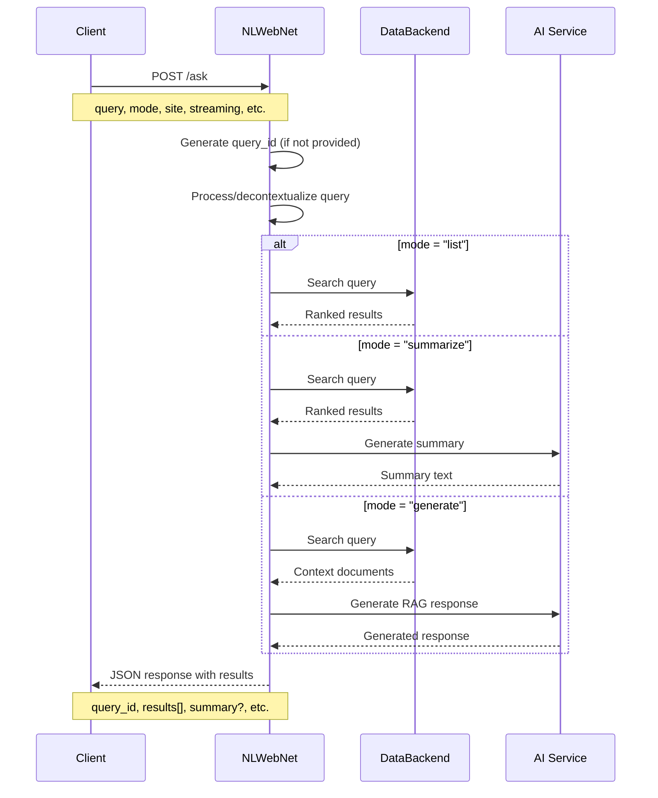
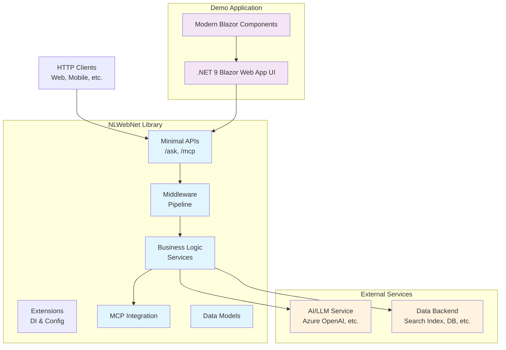

# NLWebNet

[](https://github.com/jongalloway/NLWebNet/actions/workflows/build.yml)
[](https://www.nuget.org/packages/NLWebNet/)
[](https://www.nuget.org/packages/NLWebNet/)
[](https://opensource.org/licenses/MIT)
[](https://dotnet.microsoft.com/download/dotnet/9.0)
[](https://github.com/microsoft/testfx)

A .NET implementation of the [NLWeb protocol](https://github.com/microsoft/NLWeb) for building natural language web interfaces. This project provides both a reusable library and a demo application showcasing the NLWeb standard.

> **⚠️ PROOF OF CONCEPT - NOT PRODUCTION READY**
>
> This is an experimental implementation created for **testing and evaluation purposes only**. While functional, this library is not intended for production use and should be considered a proof of concept to demonstrate NLWeb protocol capabilities in .NET environments.
>
> **Use cases:**
>
> - 🧪 Protocol evaluation and experimentation
> - 📚 Learning and understanding NLWeb concepts  
> - 🔬 Research and development prototyping
> - 🎯 Testing integration patterns with AI services
>
> **Not recommended for:**
>
> - ❌ Production applications
> - ❌ Critical business systems
> - ❌ Public-facing services
> - ❌ Applications requiring enterprise support

## 📋 Overview

NLWeb is a protocol for creating conversational interfaces to web content and data. It enables natural language querying with three main modes:

- **List**: Returns ranked search results
- **Summarize**: Provides AI-generated summaries with supporting results  
- **Generate**: Full RAG (Retrieval-Augmented Generation) responses

This implementation follows the [official NLWeb specification](https://github.com/microsoft/NLWeb) and includes Model Context Protocol (MCP) support for enhanced AI integration.

## 🏗️ Repository Structure

```
NLWebNet/
├── src/NLWebNet/              # 📦 Core library (published NuGet package)
│   ├── Models/                # Request/response data models
│   ├── Services/              # Business logic interfaces and implementations
│   ├── Endpoints/             # Minimal API endpoints (/ask, /mcp)
│   ├── MCP/                   # Model Context Protocol integration
│   ├── Extensions/            # DI and middleware extensions
│   └── Middleware/            # Request processing middleware
├── samples/                   # 🎯 Sample applications and usage examples
│   ├── Demo/                  # 🎮 .NET 9 Blazor Web App demo application  
│   └── AspireHost/            # 🏗️ .NET Aspire orchestration host  
├── doc/                       # � Documentation and setup guides
│   ├── demo-setup-guide.md    # 🔧 Complete AI integration setup guide
│   ├── manual-testing-guide.md # 🧪 API testing instructions
│   └── todo.md                # 📋 Implementation status and roadmap
├── tests/                     # 🧪 Unit and integration tests
│   └── NLWebNet.Tests/        # 📋 MSTest test project (39 tests)
├── helm/                      # ⚙️ Helm charts for Kubernetes
├── k8s/                       # ⚙️ Kubernetes manifests
├── deploy/                    # 🚀 Azure deployment templates
└── scripts/                   # �️ Build and deployment scripts
```

## 🔄 NLWeb Protocol Flow



## 🎯 API Endpoints

### `/ask` - Primary NLWeb Endpoint

Natural language query interface supporting all NLWeb protocol features.

**Required Parameters:**

- `query` - Natural language query string

**Optional Parameters:**

- `site` - Target site/domain subset
- `prev` - Comma-separated previous queries for context
- `decontextualized_query` - Pre-processed query (skips decontextualization)
- `streaming` - Enable streaming responses (default: true)
- `query_id` - Custom query identifier (auto-generated if not provided)
- `mode` - Query mode: `list` (default), `summarize`, or `generate`

### `/mcp` - Model Context Protocol Endpoint

MCP-compatible interface with additional methods:

- `list_tools` - Available tools
- `list_prompts` - Available prompts
- `call_tool` - Execute tools
- `get_prompt` - Retrieve prompt templates

## 🏛️ Architecture Overview



## 🚀 Quick Start

> **📋 Note**: This library is provided for **testing and evaluation purposes only**. This is alpha-quality software that may contain bugs or incomplete features. Please review the development status section before integrating into any project.

### Using the Library in Your Project

1. Add the NLWebNet library to your ASP.NET Core project:

```csharp
// Program.cs
using NLWebNet;

// Add NLWebNet services
builder.Services.AddNLWebNet(options =>
{
    // Configure options
    options.DefaultMode = NLWebNet.Models.QueryMode.List;
    options.EnableStreaming = true;
});

// Later in the pipeline configuration
app.UseNLWebNet();     // Add NLWebNet middleware (optional)
app.MapNLWebNet();     // Map NLWebNet minimal API endpoints
```

### Configuration Format Support

NLWebNet supports multiple configuration formats for enhanced flexibility:

#### YAML Configuration

```csharp
// Enable YAML configuration support
builder.Configuration.AddNLWebConfigurationFormats(builder.Environment);
builder.Services.AddNLWebConfigurationFormats(builder.Configuration);
```

Example YAML configuration (`config_retrieval.yaml`):

```yaml
# Multi-backend configuration
write_endpoint: primary_backend
endpoints:
  primary_backend:
    enabled: true
    db_type: azure_ai_search
    priority: 1

# NLWeb settings
nlweb:
  default_mode: List
  enable_streaming: true
  tool_selection_enabled: true
```

#### XML Tool Definitions

Define tools for the tool selection framework:

```xml
<?xml version="1.0" encoding="utf-8"?>
<ToolDefinitions>
  <Tool id="search-tool" name="Enhanced Search" type="search" enabled="true">
    <Description>Advanced search with semantic understanding</Description>
    <Parameters>
      <MaxResults>50</MaxResults>
      <TimeoutSeconds>30</TimeoutSeconds>
    </Parameters>
    <TriggerPatterns>
      <Pattern>search for*</Pattern>
      <Pattern>find*</Pattern>
    </TriggerPatterns>
  </Tool>
</ToolDefinitions>
```

#### Backward Compatibility

All existing JSON configuration continues to work unchanged. See the [Configuration Format Guide](doc/configuration-format-updates.md) for detailed documentation and migration examples.

### Prerequisites

- .NET 9.0 SDK
- Visual Studio 2022 or VS Code

### Running the Demo

1. **Clone the repository**

   ```bash
   git clone https://github.com/jongalloway/NLWebNet.git
   cd NLWebNet
   ```

2. **Build the solution**

   ```bash
   dotnet build
   ```

3. **Run the demo application**

   ```bash
   cd samples/Demo
   dotnet run
   ```

4. **Open your browser**
   - Demo UI: `http://localhost:5037`
   - OpenAPI Spec: `http://localhost:5037/openapi/v1.json`

5. **Test the demo features**
   - **Home Page**: Overview and navigation to demo features
   - **Interactive Demo** (`/nlweb`): UI for testing NLWeb queries with enhanced data source visualization
     - **Smart Data Source Management**: Automatic routing between RSS feeds (.NET content), Schema.org static data (science fiction), and mock placeholders
     - **Visual Data Source Indicators**: Top-level Bootstrap cards showing which sources are active
     - **User Guidance Prompts**: Contextual examples of what content is available to search
     - **Query input with natural language questions**: Try ".NET 9 features" for RSS data or "space movies" for sci-fi content
     - **Mode selection**: List, Summarize, Generate modes with streaming support
     - **Color-coded result badges**: Each result shows its source (RSS/Schema.org/Mock) with visual indicators
     - **HTML tag removal**: Clean display of RSS feed content
     - **API testing interface**: Direct endpoint testing with request/response inspection
   - **API Documentation**: OpenAPI specification for `/ask` and `/mcp` endpoints

> **🔧 Real AI Integration**: The demo uses mock responses by default. For actual AI-powered responses, see the [Complete Setup Guide](doc/demo-setup-guide.md) for Azure OpenAI and OpenAI API integration.

### Using the Library

> **⚠️ Alpha software - for evaluation and testing only**

Install the NuGet package:

```bash
dotnet add package NLWebNet
```

Or via Package Manager Console:

```powershell
Install-Package NLWebNet
```

Configure in your ASP.NET Core application:

```csharp
// Program.cs
using NLWebNet;

builder.Services.AddNLWebNet(options =>
{
    options.DefaultMode = QueryMode.List;
    options.EnableStreaming = true;
});

app.MapNLWebNet();
```

### Testing NLWeb Features

The demo application at `http://localhost:5037` provides testing of core NLWeb protocol features:

**Interactive Demo Pages:**

- **Home Page (`/`)**: Project overview and navigation to demo features
- **NLWeb Demo (`/nlweb`)**: Interactive query interface with tabbed sections:
  - **Query Tab**: Interactive form with all NLWeb parameters (query, mode, site, etc.)
  - **Streaming Tab**: Real-time streaming response demonstration
  - **API Test Tab**: Raw HTTP request/response testing
- **API Test (`/api-test`)**: API testing interface with request configuration
- **MCP Demo (`/mcp-demo`)**: Model Context Protocol demonstration with tools and prompts

**Query Modes Supported:**

- **List Mode**: Returns ranked search results with relevance scoring
- **Summarize Mode**: AI-generated summaries with supporting results  
- **Generate Mode**: Full RAG responses with context-aware answers
- **Streaming**: Real-time response delivery with Server-Sent Events

**API Testing:**

- Direct HTTP calls to `/ask` endpoint with various parameters
- MCP protocol testing via `/mcp` endpoint with tool and prompt support
- OpenAPI specification available at `/openapi/v1.json`
- Manual testing guides in `/doc/manual-testing-guide.md`

**Example API Usage:**

```bash
# List mode query
curl -X GET "http://localhost:5037/ask?query=find+recent+updates&mode=list"

# POST request with full parameters
curl -X POST "http://localhost:5037/ask" \
  -H "Content-Type: application/json" \
  -d '{"query": "find recent updates", "mode": "list", "site": "docs", "streaming": false}'

# Streaming summarize query  
curl -X POST "http://localhost:5037/ask" \
  -H "Content-Type: application/json" \
  -d '{"query": "what are the main features?", "mode": "summarize", "streaming": true}'

# MCP tool listing
curl -X POST "http://localhost:5037/mcp" \
  -H "Content-Type: application/json" \  -d '{"method": "list_tools"}'
```

## 🔧 Real AI Integration

The demo application works with mock responses by default, but can be configured for real AI-powered responses using Azure OpenAI or OpenAI API.

### Quick Setup

1. **Choose Your AI Provider**: Azure OpenAI (recommended) or OpenAI API
2. **Install Provider Package**:

   ```bash
   cd samples/Demo
   dotnet add package Microsoft.Extensions.AI.AzureAIInference  # For Azure OpenAI
   # OR
   dotnet add package Microsoft.Extensions.AI.OpenAI           # For OpenAI API
   ```

3. **Configure API Keys**: Update `samples/Demo/appsettings.json` or use user secrets
4. **Add Service Registration**: Update `Program.cs` with AI service registration

### Complete Setup Guide

📖 **[Complete AI Integration Guide](doc/demo-setup-guide.md)** - Step-by-step instructions for:

- Azure OpenAI and OpenAI API configuration
- Enhanced data source features and testing scenarios
- Security best practices for API key management
- Service registration and dependency injection
- Troubleshooting common setup issues
- Configuration options
- Production deployment considerations

The guide includes examples, FAQ, troubleshooting, and detailed documentation of the enhanced data source visualization features.

## ⚙️ Configuration

NLWebNet uses standard ASP.NET Core configuration patterns for managing settings and external service credentials.

### Non-Secret Configuration (appsettings.json)

Configure basic NLWebNet settings in your `appsettings.json`:

```json
{
  "NLWebNet": {
    "DefaultMode": "List",
    "EnableStreaming": true,
    "DefaultTimeoutSeconds": 30,
    "MaxResultsPerQuery": 50
  },
  "Logging": {
    "LogLevel": {
      "Default": "Information",
      "NLWebNet": "Debug"
    }
  }
}
```

### Secret Configuration (User Secrets)

For sensitive data like API keys, use [ASP.NET Core User Secrets](https://learn.microsoft.com/en-us/aspnet/core/security/app-secrets) in development:

1. **Initialize user secrets** for your project:

   ```bash
   dotnet user-secrets init
   ```

2. **Set AI service credentials** (example for Azure OpenAI):

   ```bash
   dotnet user-secrets set "AzureOpenAI:ApiKey" "your-api-key-here"
   dotnet user-secrets set "AzureOpenAI:Endpoint" "https://your-resource.openai.azure.com/"
   dotnet user-secrets set "AzureOpenAI:DeploymentName" "gpt-4"
   ```

3. **Set data backend credentials** (example for Azure Search):

   ```bash
   dotnet user-secrets set "AzureSearch:ApiKey" "your-search-api-key"
   dotnet user-secrets set "AzureSearch:ServiceName" "your-search-service"
   dotnet user-secrets set "AzureSearch:IndexName" "your-index-name"
   ```

### Production Configuration

For production deployments, use:

- **Azure Key Vault** - For secrets in Azure environments
- **Environment Variables** - For containerized deployments
- **Configuration Providers** - Custom providers for other cloud platforms

Example environment variables for production:

```bash
NLWebNet__DefaultMode=List
NLWebNet__EnableStreaming=true
AzureOpenAI__ApiKey=your-production-api-key
AzureSearch__ApiKey=your-production-search-key
```

### Configuration in Code

Access configuration in your application:

```csharp
// Program.cs
using NLWebNet;

builder.Services.AddNLWebNet(options =>
{
    // Bind from configuration
    builder.Configuration.GetSection("NLWebNet").Bind(options);
});

// Configure AI services
builder.Services.Configure<AzureOpenAIOptions>(
    builder.Configuration.GetSection("AzureOpenAI"));

// Configure data backend
builder.Services.Configure<AzureSearchOptions>(
    builder.Configuration.GetSection("AzureSearch"));
```

## 🚀 Deployment

NLWebNet supports multiple deployment options for different environments:

### 🐳 Docker Deployment

```bash
# Quick start with Docker Compose
git clone https://github.com/jongalloway/NLWebNet.git
cd NLWebNet
cd deployment/docker && docker-compose up --build
```

### ☁️ Azure Cloud Deployment

```bash
# Deploy to Azure Container Apps
./deployment/scripts/deploy/deploy-azure.sh -g myResourceGroup -t container-apps

# Deploy to Azure App Service
./deployment/scripts/deploy/deploy-azure.sh -g myResourceGroup -t app-service
```

### ⚙️ Kubernetes Deployment

```bash
# Deploy to any Kubernetes cluster
kubectl apply -f deployment/kubernetes/manifests/
```

### 📦 Container Registry

Pre-built images available soon. For now, build locally:

```bash
./deployment/scripts/deploy/build-docker.sh -t latest
```

📖 **[Complete Deployment Guide](doc/deployment/README.md)** - Comprehensive instructions for all deployment scenarios.

## 🛠️ Development Status

This is an **alpha implementation** of the NLWeb protocol, provided as an **experimental package** for testing and evaluation purposes.

### ⚠️ ALPHA SOFTWARE - EXPERIMENTAL RELEASE

**✅ Current Implementation Status:**

- [x] **Core Library**: Complete NLWeb protocol implementation with Minimal API endpoints  
- [x] **Advanced Features**: Multi-backend support, tool selection framework, YAML/XML configuration
- [x] **Data Models**: Comprehensive request/response models with validation and JSON serialization
- [x] **Business Logic**: Full service layer with Microsoft.Extensions.AI integration
- [x] **MCP Integration**: Complete Model Context Protocol support with tools and prompts
- [x] **Tool System**: Advanced tool handlers (Search, Details, Compare, Ensemble, Recipe)
- [x] **Demo Application**: .NET 9 Blazor Web App with comprehensive interactive components
- [x] **AI Integration**: Support for Azure OpenAI, OpenAI API, and GitHub Models
- [x] **Testing**: Comprehensive test suite (264 tests) with integration and performance testing
- [x] **Configuration**: Full YAML/XML/JSON support, multi-environment, multi-backend configuration
- [x] **Documentation**: Complete API documentation, guides, and examples
- [x] **CI/CD**: Production-grade automated build, test, validation, and publishing pipeline
- [x] **Deployment**: Docker, Kubernetes, Azure deployment with infrastructure automation
- [x] **NuGet Package**: Alpha prerelease at [nuget.org/packages/NLWebNet](https://www.nuget.org/packages/NLWebNet/)

**🎯 Suitable For:**

- Protocol evaluation and experimentation
- Learning NLWeb concepts and implementation patterns
- Research and development prototyping
- Testing integration patterns with AI services
- Exploring .NET AI abstractions and Model Context Protocol

**⚠️ Alpha Release Limitations:**

- **Experimental software** - may contain bugs or incomplete features
- **API surface may change** in future releases without notice
- **Not recommended for production use** - suitable for evaluation and experimentation only
- **Limited support** - community-driven development with no guarantees
- **Performance and reliability** not yet optimized for production workloads
- **Feature completeness** varies - some advanced NLWeb features may be basic implementations

## 🤝 Contributing

This project follows the [NLWeb specification](https://github.com/microsoft/NLWeb). Contributions are welcome!

1. Review the [current tasks](doc/todo.md) and [design decisions](doc/design-decisions.md)
2. Check [open issues](https://github.com/jongalloway/NLWebNet/issues)
3. Submit pull requests with tests

## 📖 Related Resources

- **[NLWeb Official Repository](https://github.com/microsoft/NLWeb)** - Specification and reference implementation
- **[Complete Demo Setup Guide](doc/demo-setup-guide.md)** - Step-by-step AI integration instructions
- **[Model Context Protocol](https://modelcontextprotocol.io/)** - MCP documentation
- **[Microsoft.Extensions.AI](https://learn.microsoft.com/en-us/dotnet/ai/)** - .NET AI abstractions
- **[Manual Testing Guide](doc/manual-testing-guide.md)** - API testing with curl examples

## 📄 License

This project is licensed under the [MIT License](LICENSE).

## 🏷️ Version

[](https://www.nuget.org/packages/NLWebNet/) - Alpha release with comprehensive features

Complete NLWeb protocol implementation with advanced features, AI integration, and production-ready infrastructure for testing and evaluation purposes.

**Key Features (Production Alpha Quality):**

- ✅ Complete NLWeb protocol implementation (/ask, /mcp endpoints)
- ✅ Advanced tool system with intelligent query routing
- ✅ Multi-backend retrieval architecture with concurrent querying
- ✅ Full AI integration support (Azure OpenAI, OpenAI API, GitHub Models)
- ✅ .NET 9 Blazor demo application with comprehensive testing interface
- ✅ Complete Model Context Protocol (MCP) support
- ✅ Streaming responses with Server-Sent Events
- ✅ YAML/XML/JSON configuration support
- ✅ Comprehensive documentation and deployment guides
- ✅ Production-ready NuGet package with full extension methods
